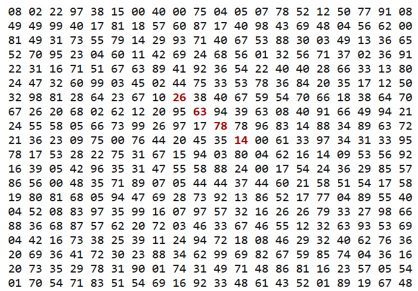

# Project Euler Questions 

## [Problem 1](https://projecteuler.net/problem=1)
If we list all the natural numbers below $10$ that are multiples of $3$ or $5$, we get $3, 5, 6$ and $9$. The sum of these multiples is $23$.
Find the sum of all the multiples of $3$ or $5$ below $1000$.

You might want to approach this by considering the sum of an arithmetic progression or by iterating from 1 to 1000 and adding the current number to the total if it is divisable by either 3 or 5.

<details>
    <summary>Hint 1 - using arithmetic progression formula</summary>
	
    Since we need to find the sum of all multiples, it would make sense to list out all the
	multiple of a number in a sequence. Since it is a sequence, we can discuss as to what type
	of sequence it is. This one turns out to be an arithmetic progression. The sum of an A.P is
	n*(2*a + (n-1)*d)/2 where 'n' is the number of terms, 'a' is the first term of the series
	and 'd' is the difference between any two consecutive terms of the sequence.
	Use the formula of sum of arithmetic progressions and add the progressions of 3 and 5 
	and subtract the common progression once from them i.e the progression of 15. This gives us
	the sum of all the multiples of both 5 and 3.
</details>

<details>
<summary>Hint 2 - handy if statement for loop solution</summary>
	
```Java
if (i % 3 == 0 || i % 5 == 0){...}
```
</details>

=======================================================================================
## [Problem 2](https://projecteuler.net/problem=2)
Each new term in the Fibonacci sequence is generated by adding the previous two terms. By starting with $1$ and $2$, the first $10$ terms will be:
$$1, 2, 3, 5, 8, 13, 21, 34, 55, 89, \dots$$

By considering the terms in the Fibonacci sequence whose values do not exceed four million, find the sum of the even-valued terms.

<details>
<summary>Hint 1 - initialise variables</summary>
	
```Java
int sum = 0;
int x = 1;  // Represents the current Fibonacci number being processed
int y = 2;  // Represents the next Fibonacci number in the sequence
```
</details>

<details>
<summary>Hint 2 - While loop is handy here</summary>
	
```Java
while (x <= 4000000) {...}
```
</details>

<details>
<summary>Hint 3 - Use modulus operator ('%') to check for even numbers</summary>
	
```Java
if (x % 2 == 0)
```
</details>

=======================================================================================
## [Problem 3](https://projecteuler.net/problem=3)
The prime factors of $13195$ are $5, 7, 13$ and $29$.

What is the largest prime factor of the number $600851475143$?

### This one is much harder than the previous 2 and you may want to skip it

<details>
<summary>Hint 1</summary>

By the fundamental theorem of arithmetic, every integer n > 1 has a unique factorization as a product of prime numbers. In other words, the theorem says that n = p_0 * p_1 * ... * p_{m-1}, where each p_i > 1 is prime but not necessarily unique. Now if we take the number n and repeatedly divide out its smallest factor (which must also be prime), then the last factor that we divide out must be the largest prime factor of n. For reference, 600851475143 = 71 * 839 * 1471 * 6857.
</details>

=======================================================================================
## [Problem 4](https://projecteuler.net/problem=4)
A palindromic number reads the same both ways. The largest palindrome made from the product of two $2$-digit numbers is $9009 = 91 \times 99$.

Find the largest palindrome made from the product of two $3$-digit numbers.

The easiest way to do this problem is to convert the number into a String and then compare that String with a reversed version of it. Here are two helper methods:

```Java
	// Tests whether the given string is a palindrome.
	public static boolean isPalindrome(String s) {
		return s.equals(reverse(s));
	}
	
	
	// Tests whether the given integer is a palindrome in decimal (base 10).
	public static boolean isPalindrome(int x) {
		return isPalindrome(Integer.toString(x));
	}
```

=======================================================================================
## [Problem 6](https://projecteuler.net/problem=6)
The sum of the squares of the first ten natural numbers is,

$$1^2 + 2^2 + \dots + 10^2 = 385.$$

The square of the sum of the first ten natural numbers is,

$$(1 + 2 + \dots + 10)^2 = 55^2 = 3025.$$

Hence the difference between the sum of the squares of the first ten natural numbers and the square of the sum is $3025 - 385 = 2640$.

Find the difference between the sum of the squares of the first one hundred natural numbers and the square of the sum.

<details>
<summary>Hint 1</summary>
Computers are fast, so we can implement this solution directly without any clever math.

* However for the mathematically inclined, there are closed-form formulas:
$$sum  = N(N + 1) / 2$$
$$sum2 = N(N + 1)(2N + 1) / 6$$ 
$$sum^2 - sum2 = (N^4 / 4) + (N^3 / 6) - (N^2 / 4) - (N / 6)$$
</details>

<details>
<summary>Hint 2 - Your for loop will look something like this</summary>
	
```Java
for (int i = 1; i <= N; i++) {...} // where N = 100
```
</details>

<details>
<summary>Hint 3 - And it will contain something like this</summary>
	
```Java
sum += i;
sum2 += i * i;
```
</details>

=======================================================================================
## [Problem 7](https://projecteuler.net/problem=7)
By listing the first six prime numbers: $2, 3, 5, 7, 11$, and $13$, we can see that the $6$ th prime is $13$.

What is the $10\,001$ st prime number?
<details>
<summary>Hint 1</summary>
Computers are fast, so we can implement this solution by testing each number individually for primeness, instead of using the more efficient sieve of Eratosthenes.
</details>

<details>
<summary>Hint 2 - make a method that return true if a number is prime</summary>
	
```Java
public static boolean isPrime(int x) {...}
```
</details>

<details>
<summary>Hint 3 - here is a potential implementation</summary>
	
```Java
// Tests whether the given non-negative integer is prime.
public static boolean isPrime(int x) {
	if (x < 0)
		throw new IllegalArgumentException("Negative number");
	if (x == 0 || x == 1)
		return false;
	else if (x == 2)
		return true;
	else {
		if (x % 2 == 0)
			return false;
		for (int i = 3, end = sqrt(x); i <= end; i += 2) {
			if (x % i == 0)
				return false;
		}
		return true;
	}
}
```
</details>

<details>
<summary>Hint 4 - your for loop might look like this for counting primes</summary>
	
```Java
for (int i = 2, count = 0; ; i++) {...}
```
</details>

=======================================================================================
## Problem 8 (this not not a project Euler problem)

Find the maximum product for 5 adjacent integers in the following array: 

```Java
int[] nums = {7,3,1,6,7,1,7,6,5,3,1,3,3,0,6,2,4,9,1,9,2,2,5,1,1,9,6,7,4,4,2,6,5,7,4,7,4,2,3,5,5,3,4,9,1,9,4,9,3,4};
```

<details>
<summary>Hint 1 - your outer for loop might look like this</summary>
	
```Java
for (int i = 0; i <= nums.length - 5; i++) {...}
```
</details>

<details>
<summary>Hint 2 - your inner for loop might look like this</summary>
	
```Java
for (int i = 0; i <= nums.length - 5; i++) {...}
```
</details>

=======================================================================================
## [Problem 11](https://projecteuler.net/problem=11)

In the $20 \times 20$ grid below, four numbers along a diagonal line have been marked in red.



The product of these numbers is $26 \times 63 \times 78 \times 14 = 1788696$.

What is the greatest product of four adjacent numbers in the same direction (up, down, left, right, or diagonally) in the $20 \times 20$ grid?

To get you started here is the grid in a 2-d array:

```Java
int[][] SQUARE = {
		{ 8, 2,22,97,38,15, 0,40, 0,75, 4, 5, 7,78,52,12,50,77,91, 8},
		{49,49,99,40,17,81,18,57,60,87,17,40,98,43,69,48, 4,56,62, 0},
		{81,49,31,73,55,79,14,29,93,71,40,67,53,88,30, 3,49,13,36,65},
		{52,70,95,23, 4,60,11,42,69,24,68,56, 1,32,56,71,37, 2,36,91},
		{22,31,16,71,51,67,63,89,41,92,36,54,22,40,40,28,66,33,13,80},
		{24,47,32,60,99, 3,45, 2,44,75,33,53,78,36,84,20,35,17,12,50},
		{32,98,81,28,64,23,67,10,26,38,40,67,59,54,70,66,18,38,64,70},
		{67,26,20,68, 2,62,12,20,95,63,94,39,63, 8,40,91,66,49,94,21},
		{24,55,58, 5,66,73,99,26,97,17,78,78,96,83,14,88,34,89,63,72},
		{21,36,23, 9,75, 0,76,44,20,45,35,14, 0,61,33,97,34,31,33,95},
		{78,17,53,28,22,75,31,67,15,94, 3,80, 4,62,16,14, 9,53,56,92},
		{16,39, 5,42,96,35,31,47,55,58,88,24, 0,17,54,24,36,29,85,57},
		{86,56, 0,48,35,71,89, 7, 5,44,44,37,44,60,21,58,51,54,17,58},
		{19,80,81,68, 5,94,47,69,28,73,92,13,86,52,17,77, 4,89,55,40},
		{ 4,52, 8,83,97,35,99,16, 7,97,57,32,16,26,26,79,33,27,98,66},
		{88,36,68,87,57,62,20,72, 3,46,33,67,46,55,12,32,63,93,53,69},
		{ 4,42,16,73,38,25,39,11,24,94,72,18, 8,46,29,32,40,62,76,36},
		{20,69,36,41,72,30,23,88,34,62,99,69,82,67,59,85,74, 4,36,16},
		{20,73,35,29,78,31,90, 1,74,31,49,71,48,86,81,16,23,57, 5,54},
		{ 1,70,54,71,83,51,54,69,16,92,33,48,61,43,52, 1,89,19,67,48},
	};
```
